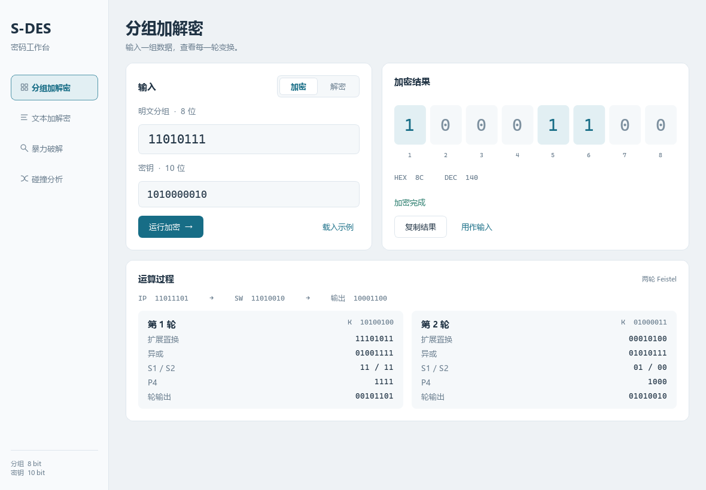
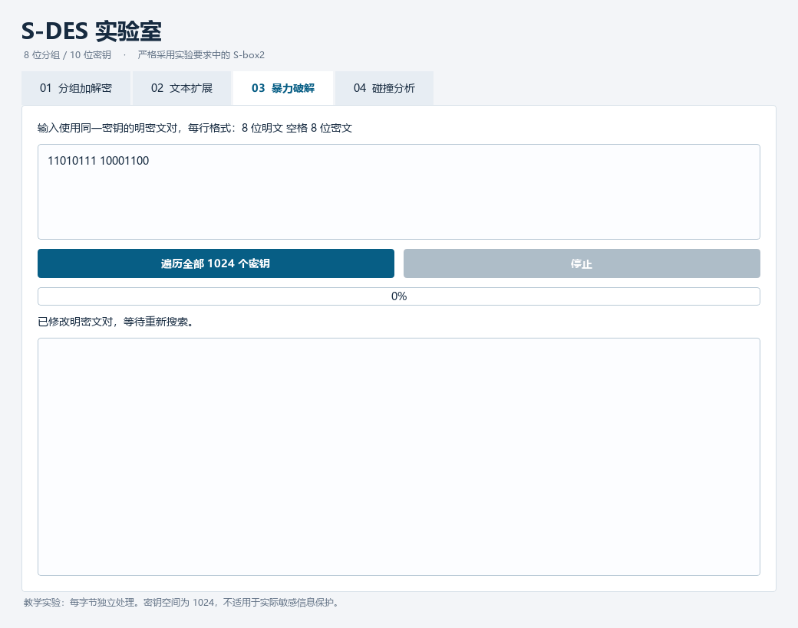

# S-DES 算法实现

信息安全导论 · 作业 1。一个用于探索 S-DES 分组加密、密钥搜索和碰撞现象的桌面工具。

本地源码、测试与文档已完成，仓库尚未上传。推送步骤见 [上传说明](docs/上传说明.md)。

| 组员 | 姓名 | 学号 |
| --- | --- | --- |
| 1 | | |
| 2 | | |

## 启动

Windows 安装 Python 3.10 或更新版本后，双击 **`run.bat`**。首次启动自动创建项目虚拟环境并安装 Qt 依赖。

Windows 启动入口已单独验证。脚本使用 CRLF 换行；启动失败时会保留窗口，并将具体原因记录在 `startup.log`。

也可手动运行：

```powershell
python -m venv .venv
.venv\Scripts\python -m pip install -r requirements.txt
.venv\Scripts\python main.py
```

macOS / Linux：

```bash
python3 -m venv .venv
.venv/bin/python -m pip install -r requirements.txt
.venv/bin/python main.py
```

图形界面包括二进制加解密与轮函数跟踪、ASCII/UTF-8 文本、已知明密文暴力破解、密钥碰撞分析。



## 实验成果

| 要求 | 实现与证据 |
| --- | --- |
| 第一关：基本测试 | 8 位数据、10 位密钥、GUI 交互；262,144 次加解密往返全部通过 |
| 第二关：交叉测试 | Python 与独立 C++ 实现的 262,144 个结果逐字节一致；35 组交换向量；真实外组记录留空 |
| 第三关：扩展功能 | 按字节处理 ASCII；Hex、Base64、转义字节无损密文；额外支持 UTF-8 |
| 第四关：暴力破解 | 单组/多组已知明密文、全部候选密钥、纳秒计时、开始结束时间戳、Qt 后台线程、动图 |
| 第五关：封闭测试 | 256 个明文 × 1024 个密钥的碰撞统计、可复现随机案例、抽屉原理分析 |
| 文档与规范 | 纯函数密码核心、模块化 GUI、用户指南、开发手册、接口说明、实验报告 |

成员信息与外组测试记录留空。本地运行环境为 Windows；仓库另含 Windows/Linux/macOS 验证工作流，运行结果可在 Actions 查看。

## 文档入口

- [实验报告](docs/实验报告.md) / [PDF 版](output/pdf/S-DES实验报告.pdf)
- [用户指南](docs/用户指南.md)
- [开发手册与接口文档](docs/开发手册.md)
- [要求逐项核对及提交记录](docs/要求核对.md)
- [跨组测试记录](docs/跨组测试记录.md)
- [机器可读结果汇总](evidence/summary.json)

## 暴力破解演示



动图使用真实 Qt 控件的离屏渲染帧。为便于阅读延长了每帧停留时间；实际破解时间以界面中的 `perf_counter_ns` 计时和 [GUI 原始记录](evidence/gui_checks.json) 为准。

## 快速验证

核心算法和命令行只使用 Python 标准库，无需安装 Qt：

```bash
python -m unittest discover -s tests -v
python -m sdes encrypt 11010111 --key 1010000010
python -m sdes decrypt 10001100 --key 1010000010
python -m sdes crack --pairs-file evidence/known_pairs.txt
python tools/verify_vectors.py evidence/cross_vectors.json
```

加密输出 `10001100`，解密输出 `11010111`。重新生成全部数值实验还需要 `g++`：

```bash
python tools/run_experiments.py
```

## 目录

```text
main.py                    桌面程序入口
sdes/                      算法、编码、破解、GUI、CLI
reference/                 独立 C++ 字符串实现
tests/                     核心和边界测试
tools/                     全量实验、GUI 检查、动图、报告生成
evidence/                  JSON / CSV / 日志 / 截图 / GIF
docs/                      实验报告、用户指南、开发手册、提交核对
output/pdf/                PDF 实验报告
.github/workflows/         跨平台自动验证
```

S-DES 的密钥空间只有 1024，属于教学密码。该实验逐字节独立加密，不具备实际安全通信所需的强度和完整性认证。
