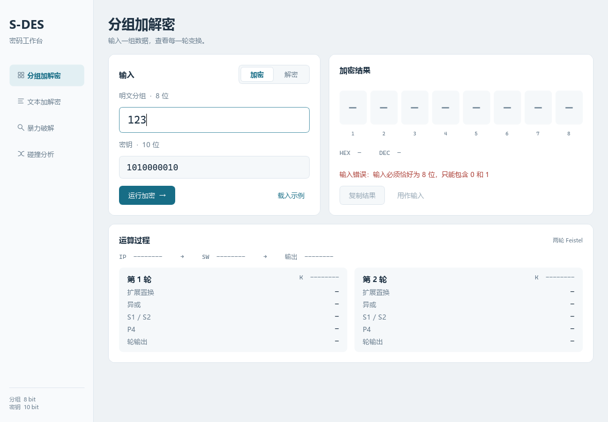
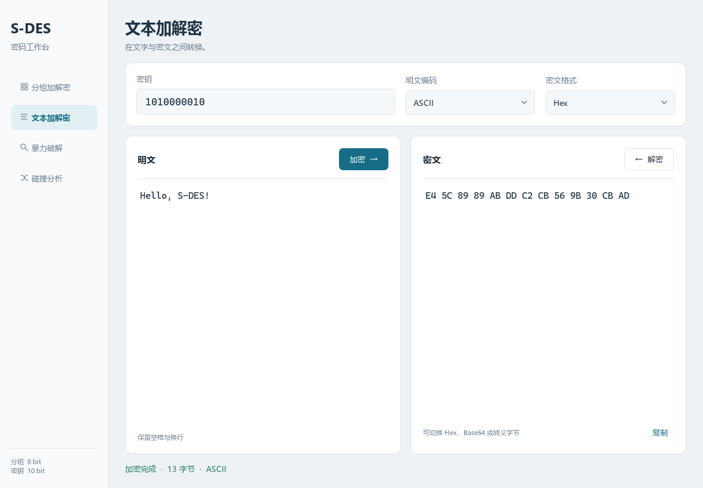
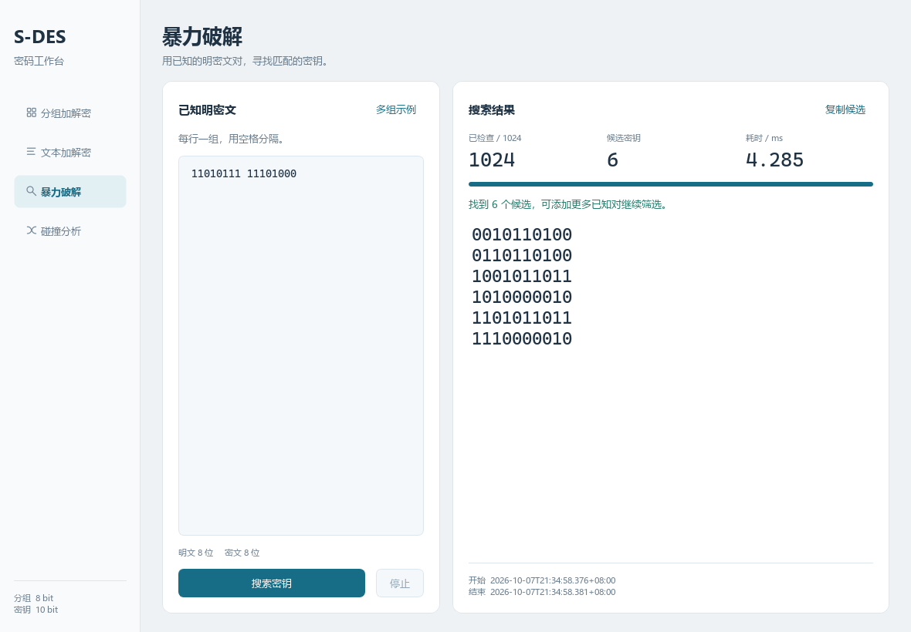
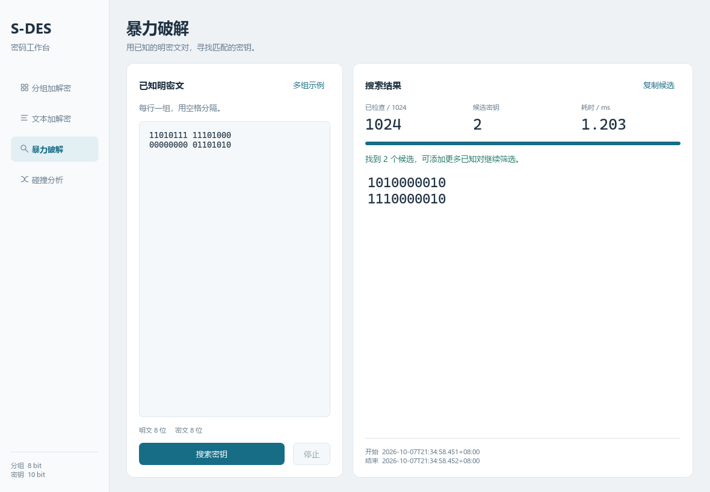
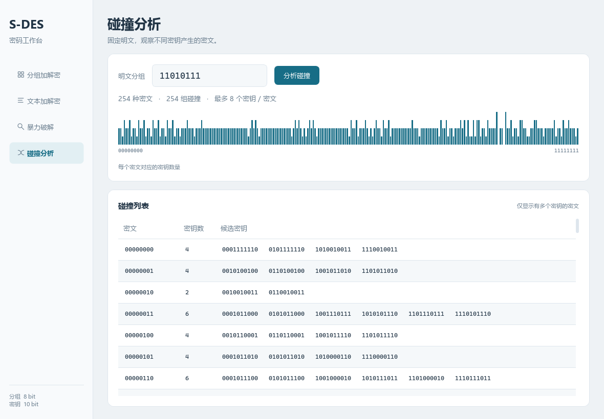

# 信息安全导论实验报告

## 实验一 S-DES 算法实现

| 组员 | 姓名 | 学号 |
| --- | --- | --- |
| 1 | 蔡旭涛 | 20240947 |
| 2 | 扶满 | 20245177 |

## 一 实验目的

实现一个具有图形界面的 S-DES 加解密程序，观察置换、子密钥生成和两轮 Feistel 变换的过程。在此基础上，将分组运算扩展到 ASCII 字符串，并利用已知明密文对搜索密钥。

实验分为基本测试、交叉测试、扩展功能、暴力破解和封闭测试五关。通过逐关测试，分析固定密钥时的加密可逆性，以及固定明文时不同密钥产生相同密文的现象。

## 二 实验环境与程序结构

| 项目 | 环境 |
| --- | --- |
| 操作系统 | Windows-10-10.0.26200-SP0 |
| 主程序 | Python 3.10.0 |
| 图形界面 | PySide6-Essentials 6.11.2 |
| 参考程序 | C++11，MinGW GCC 13.1.0 |

程序按算法、编码、分析和界面划分模块。核心函数接收整数或字节串并返回计算结果，GUI 和命令行调用相同接口。C++ 版本采用字符串置换和异或运算，用于交叉验证。

| 文件 | 主要功能 |
| --- | --- |
| sdes/core.py | 置换、子密钥、加解密和中间步骤 |
| sdes/encoding.py | ASCII、UTF-8 和密文格式转换 |
| sdes/analysis.py | 穷举密钥、计时、碰撞统计 |
| sdes/gui.py | 图形交互和后台搜索线程 |
| reference/sdes_reference.cpp | C++ 参考实现 |

项目仓库：https://github.com/Cyanlament/realization-of-S-DES-algorithm。Windows 可直接运行 dist/S-DES.exe，也可通过 run.bat 启动源码版。

## 三 基本原理

S-DES 的分组长度为 8 位，主密钥长度为 10 位。置换位置从最高位开始按 1 编号。加密依次执行初始置换、第一轮变换、左右交换、第二轮变换和逆初始置换。

| 变换 | 位置顺序 |
| --- | --- |
| P10 | 3, 5, 2, 7, 4, 10, 1, 9, 8, 6 |
| P8 | 6, 3, 7, 4, 8, 5, 10, 9 |
| IP | 2, 6, 3, 1, 4, 8, 5, 7 |
| 逆 IP | 4, 1, 3, 5, 7, 2, 8, 6 |
| EP | 4, 1, 2, 3, 2, 3, 4, 1 |
| P4 | 2, 4, 3, 1 |

### 子密钥生成

主密钥先经过 P10，分为两个 5 位半部。两个子密钥均从这两个半部生成：分别循环左移 1 位，合并后经 P8 得到 K1；分别循环左移 2 位，合并后经 P8 得到 K2。密钥扩展为 Ki = P8(Shift^i(P10(K)))，i = 1, 2。

### 轮函数与解密

右半部经 EP 扩展为 8 位，与本轮子密钥异或。异或结果分成两个 4 位输入，分别查 S-box1 和 S-box2；每个输入的外侧两位选行，内侧两位选列。两个 2 位输出拼接后经过 P4，再与左半部异或，右半部保持不变。

| 行号 | S-box1 | S-box2 |
| --- | --- | --- |
| 0 | 1, 0, 3, 2 | 0, 1, 2, 3 |
| 1 | 3, 2, 1, 0 | 2, 3, 1, 0 |
| 2 | 0, 2, 1, 3 | 3, 0, 1, 2 |
| 3 | 3, 1, 0, 2 | 2, 1, 0, 3 |

两轮之间交换左右半部。解密沿用相同结构，先使用 K2，再使用 K1。固定密钥下，异或运算可逆，Feistel 结构因此可以恢复原分组。

```text
加密：IP → 第一轮 K1 → SW → 第二轮 K2 → 逆 IP
解密：IP → 第一轮 K2 → SW → 第二轮 K1 → 逆 IP
```

## 四 实验过程与结果

### 第一关 基本测试

在分组加解密页输入明文 11010111 和密钥 1010000010，选择加密模式并运行。结果为 11101000；将该结果用作输入后切换到解密模式，输出恢复为 11010111。


| 操作 | 输入分组 | 密钥 | 输出分组 |
| --- | --- | --- | --- |
| 加密 | 11010111 | 1010000010 | 11101000 |
| 解密 | 11101000 | 1010000010 | 11010111 |

对全部 1024 把密钥和 256 个明文逐一验证加密后再解密，共完成 262,144 次往返，均恢复原文。对任一固定密钥，256 个明文对应 256 个不同密文。

自动测试通过 21 项算法与边界检查，以及 28 项界面检查。界面检查覆盖加解密、结果复用、格式转换、搜索线程、导航和最小窗口尺寸。

### 第一关 运算跟踪与输入检查

下表展开同一测试向量的中间步骤，用于核对位序、子密钥生成和两轮运算。异或记为 ⊕：相同两位得到 0，不同两位得到 1。轮函数先计算 EP(R) ⊕ K，再将 S-box 输出经 P4 后与左半部异或。

| 步骤 | 结果 |
| --- | --- |
| P10 后的密钥 | 1000001100 |
| 左移 1 位后的两半拼接 | 0000111000 |
| K1 | 10100100 |
| P10 两半左移 2 位后的拼接 | 0001010001 |
| K2 | 10010010 |
| 初始置换 IP | 11011101 |
| 第一轮 EP / 异或 | 11101011 / 01001111 |
| 第一轮 S1 / S2 / P4 | 11 / 11 / 1111 |
| 第一轮输出 / SW | 00101101 / 11010010 |
| 第二轮 EP / 异或 | 00010100 / 10000110 |
| 第二轮 S1 / S2 / P4 | 00 / 11 / 0110 |
| 第二轮输出 / 最终密文 | 10110010 / 11101000 |

输入 123、不足 8 位的分组、超过 10 位的密钥或含有内部空格的二进制串时，程序给出格式提示并清除旧结果。首尾空白会在解析时去除。



### 第二关 交叉测试

Python 版本使用整数位运算，C++ 版本使用字符串置换。两者采用相同的置换表、S-box 和子密钥生成方式。测试先比较两种实现对同一明文、同一密钥的加密结果，再把 Python 生成的密文交给 C++ 解密。

| 比较项目 | 测试范围 | 结果 |
| --- | --- | --- |
| 加密结果比较 | 1024 把密钥 × 256 个明文 | 262,144 组一致，0 组差异 |
| C++ 解密 Python 密文 | 5 把密钥 × 7 个明文 | 35 组均恢复原文 |
| 本次运行环境 | 同一台 Windows 计算机 | Python / C++ 均为 64 位 |

固定密钥 1010000010，选取下列明文比较输出。表中密文同时通过 Python 加密和 C++ 解密核对。完整交换向量保存在 evidence/cross_vectors.json。

| 明文 P | Python 密文 | C++ 密文 | C++ 解密结果 |
| --- | --- | --- | --- |
| 00000000 | 01101010 | 01101010 | 00000000 |
| 00000001 | 01000101 | 01000101 | 00000001 |
| 01000001 | 10010001 | 10010001 | 01000001 |
| 01010101 | 00000101 | 00000101 | 01010101 |
| 10101010 | 00001001 | 00001001 | 10101010 |
| 11010111 | 11101000 | 11101000 | 11010111 |
| 11111111 | 10001110 | 10001110 | 11111111 |

#### 外组互验记录

此前与其他小组同学进行的交叉测试均通过。本次修正子密钥生成后，测试向量已重新导出；修正版的外组互验结果待补充。

| 跨组测试项目 | 修正版结果 |
| --- | --- |
| 同一明文、同一密钥的加密结果比较 | 待互验 |
| 交换密文后的解密验证 | 待互验 |

验证程序读取交换文件后逐条执行加密与解密，输出不一致时列出对应向量。

```text
python tools/verify_vectors.py evidence/cross_vectors.json
```

### 第三关 扩展功能

将 ASCII 字符串按每字节 8 位分组，使用同一把密钥逐字节加密。解密后按原编码还原字符串，保留空格和换行；空字符串返回空结果。

在文本页输入 Hello, S-DES!，密钥为 1010000010，明文编码选择 ASCII。加密得到 13 个字节，再解密恢复原字符串。



| 项目 | 结果 |
| --- | --- |
| 明文 | Hello, S-DES! |
| Hex 密文 | E4 5C 89 89 AB DD C2 CB 56 9B 30 CB AD |
| Base64 密文 | 5FyJiavdwstWmzDLrQ== |
| 解密结果 | Hello, S-DES! |

密文中包含 E4、89 等超出 ASCII 范围的字节，不能直接作为 ASCII 文本显示。界面提供 Hex、Base64 和转义字节三种表示，切换格式时转换的是同一组密文字节。

测试覆盖 0 至 127 的全部 ASCII 值，以及 0 至 255 的全部字节。额外的 UTF-8 模式支持中文及其他多字节字符，中文测试字符串加密解密后保持一致。

### 第四关 暴力破解

10 位密钥共有 1024 种取值。程序从 0000000000 枚举到 1111111111，对每把候选密钥检查所有已知明密文对，保存满足全部条件的密钥。某一对不匹配时跳过当前候选，最坏需要执行 1024m 次检查，其中 m 为已知对数。

先输入明文 11010111、密文 11101000。搜索得到 6 把密钥：0010110100、0110110100、1001011011、1010000010、1101011011、1110000010。原始密钥 1010000010 包含在候选中。



保持密钥不变，逐步增加不同明文对应的密文。候选数从 6 缩小到 2，2 组输入见下表。

| 已知对数 | 新增明文 | 新增密文 | 候选数 |
| --- | --- | --- | --- |
| 1 | 11010111 | 11101000 | 6 |
| 2 | 00000000 | 01101010 | 2 |

### 第四关 多组约束与计时

加入 2 组明密文对后，剩余候选为 1010000010 和 1110000010。两把密钥生成相同的 K1、K2，对全部 256 个明文的加密结果均相同。搜索运行在 Qt 后台线程中；停止操作返回已检查范围内的候选，相互矛盾的已知对得到空结果。



| 测量 | 耗时 |
| --- | --- |
| GUI 单组明密文对 | 4.2847 ms |
| GUI 2 组明密文对 | 1.2029 ms |
| 核心搜索首次计算子密钥 | 4.1060 ms |
| 核心搜索 30 次缓存命中中位数 | 1.1523 ms |
| 30 次缓存命中最小值 / 最大值 | 0.9805 / 2.1348 ms |

耗时由 perf_counter_ns 记录，测量范围为密钥搜索循环。多组输入的 UTC 时间戳如下，界面按本地时区显示。

```text
开始 2026-10-07T13:34:58.451453+00:00
结束 2026-10-07T13:34:58.452801+00:00
```


### 第五关 封闭测试

#### 随机选择的明密文对是否对应多个密钥

使用随机种子 20261007 生成明文 P=01110100 和密钥 K=1011010110，加密得到 C=01011010。对这一组明密文穷举，得到 4 把候选密钥：

```text
1000101111
1011010110
1100101111
1111010110
```

该样本对应多个密钥。若明密文对由加密程序生成，至少存在一把原始密钥；本次构造中，主密钥第 2 位不进入两个子密钥，因此翻转这一位会得到另一把等价密钥。若任意独立选择 P 和 C，则还可能选中不可达的密文而没有候选。

#### 任意给定明文是否存在不同密钥产生相同密文

存在。固定一个明文 P，1024 把密钥最多产生 256 种 8 位密文。把密钥按输出密文分组，由抽屉原理，至少一个密文组包含 4 把或更多密钥，因此一定能找到两把不同密钥，使它们对该明文产生相同密文。

枚举全部 256 个明文，每个明文再枚举 1024 把密钥，统计结果如下。每个明文都出现了密钥碰撞，与上述推导一致。

| 统计项目 | 结果 |
| --- | --- |
| 明文数 | 256 |
| 明文与密钥组合数 | 262,144 |
| 出现碰撞的明文数 | 256 |
| 固定明文的可达密文数 | 254 至 254 |
| 单个密文对应密钥数的最大值 | 8 |
| P=11010111 的碰撞组 / 单例组 | 254 / 0 |
| P=11010111 的无序碰撞密钥对 | 1728 |
| 不同的完整加密排列数 | 512 |
| 全空间等价密钥组数 | 512 |

### 第五关 碰撞分布与结果分析



以 P=11010111 为例，1024 把密钥产生 254 种密文，每种可达密文均对应多把密钥。例如密文 11101000 对应第四关得到的 6 把候选密钥。

进一步比较每把密钥对全部 256 个明文的加密结果，得到 512 种不同排列和 512 组等价密钥，每组两把。仅在一个明文上碰撞的密钥仍可能被其他明密文对区分；生成相同子密钥的等价密钥则无法通过增加输入区分。固定密钥时明文可逆，固定明文时密钥可能碰撞，两种现象分别对应不同映射。

## 五 实验总结

本次实验完成了分组加解密、ASCII 扩展、已知明密文搜索和碰撞分析。Python 与 C++ 对全部输入组合的加密结果一致。单组明密文对产生多个候选，增加约束可以缩小候选范围，但无法区分生成相同子密钥的等价密钥。

两个子密钥分别从 P10 的同一结果生成。密文按字节保存，显示时再转换为 Hex、Base64 或转义形式。S-DES 的密钥空间很小，可以直接穷举，适合观察分组密码结构与密钥碰撞。

完整测试数据保存在 evidence/，程序使用方法和接口说明分别见 docs/用户指南.md 与 docs/开发手册.md。
